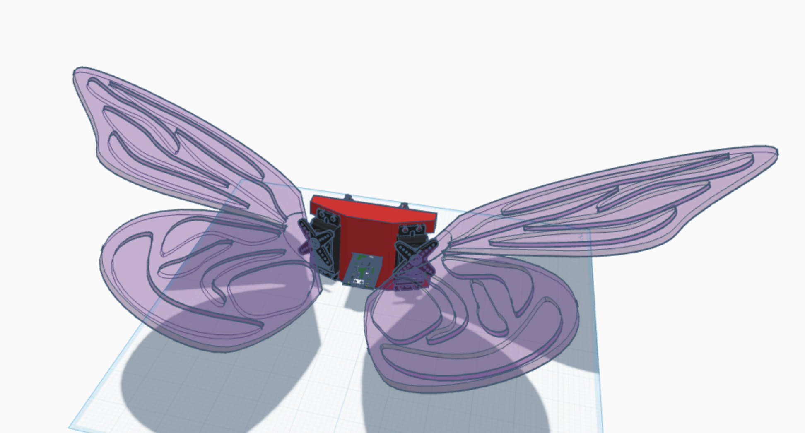
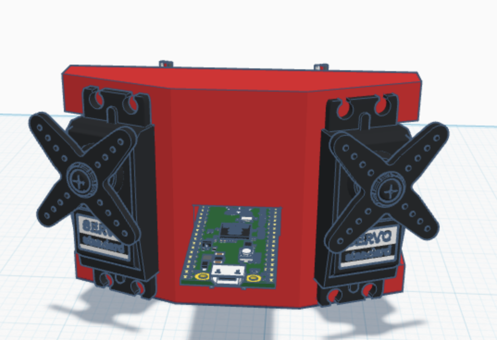
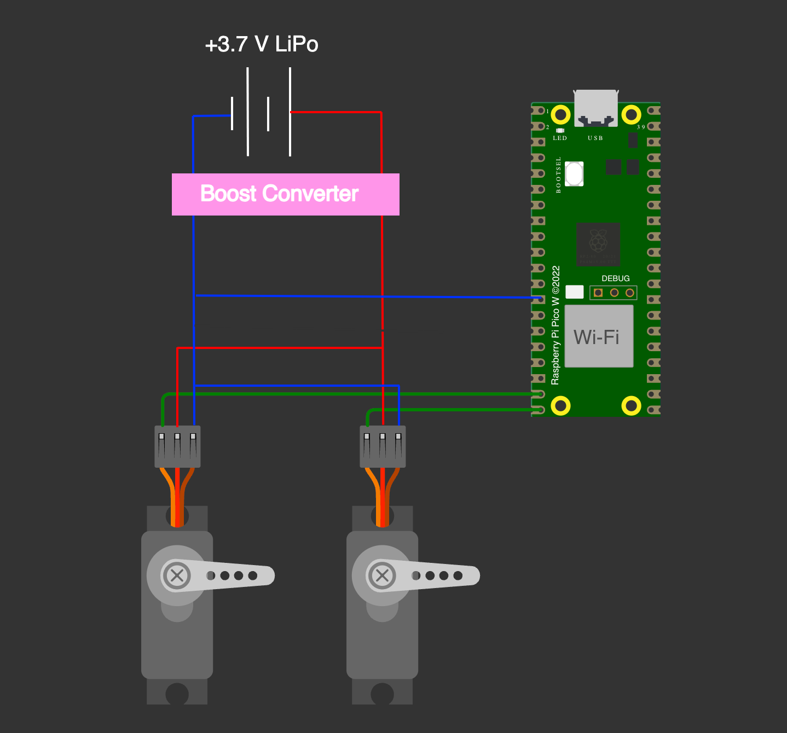

# Bionic-Butterfly
A butterfly-like drone that can be manually controlled from your computer.

## Why I made this project
For a while now, I've been wanted to create bigger hardware projects than the ones that I had been making previously. I wanted to make an aesthetic project that would make me go beyond my limits. Making a drone was the first idea that came to mind, and with the help of my Instagram feed, I got inspired to make a butterfly drone, leading to the creation of this project!

### 3D model of whole project

### 3D model of main body with Servos and Raspberry Pi Pico

### Wiring Diagram

The battery is probably going to be a 1S LiPo battery of somesort that I can just attach to the mainbody next to the Pico. Because of this, I will need a boost converter to make the 3.7V to 5V. Both of these will most likely be glued to the main body.